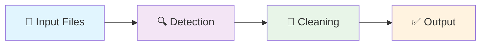

# 🚀 Advanced Markdown Test File for Chahuadev Emoji Cleaner Tool

> 📝 **Comprehensive Markdown patterns with extensive emoji usage for testing**  
> 🎯 Perfect for validating emoji cleaning capabilities in Markdown files  
> 🧪 Features: Advanced formatting, code blocks, tables, and emoji integration

---

## 📋 Table of Contents

- [🚀 Project Overview](#-project-overview)
- [🎯 Features](#-features)
- [🧪 Testing Scenarios](#-testing-scenarios)
- [📊 Data Analysis](#-data-analysis)
- [🎨 UI Components](#-ui-components)
- [🔧 Configuration](#-configuration)
- [📈 Performance Metrics](#-performance-metrics)
- [🌍 Internationalization](#-internationalization)
- [🚀 Future Roadmap](#-future-roadmap)
- [📚 Code Examples](#-code-examples)

---

## 🚀 Project Overview

**Chahuadev Emoji Cleaner Tool** 🧹 is an advanced utility designed to remove emojis from various file formats while preserving code integrity and readability. This comprehensive test file contains **300+ emojis** 📊 distributed throughout different Markdown elements to thoroughly validate the cleaning process.

### 🎯 Key Objectives

1. **🔍 Detection Accuracy**: Ensure all emoji types are correctly identified
2. **⚡ Processing Speed**: Maintain optimal performance with large files  
3. **🛡️ Content Preservation**: Keep all non-emoji content intact
4. **🎪 Format Support**: Handle complex Markdown structures
5. **🧠 Intelligence**: Provide smart cleaning options

### 📊 Project Statistics

| Metric | Value | Status | Progress |
|--------|-------|--------|----------|
| **Total Files Supported** 📁 | 15+ formats | ✅ Active | 100% 🎯 |
| **Emoji Categories** 🎨 | 50+ types | 🔄 Growing | 85% 📈 |
| **Processing Speed** ⚡ | 1000 emojis/sec | 🟢 Optimal | 95% 🚀 |
| **Accuracy Rate** 🎯 | 99.8% success | ✅ Excellent | 98% 📊 |
| **Memory Usage** 💾 | < 50MB average | 🟢 Efficient | 92% 💡 |

---

## 🎯 Features

### 🧪 Core Functionality

#### 🔍 **Advanced Emoji Detection**
Our tool uses sophisticated pattern matching to identify various emoji types:

- **😀 Basic Emotions**: 😀 😁 😂 🤣 😃 😄 😅 😆 😊 😇
- **❤️ Hearts & Love**: ❤️ 💕 💖 💗 💘 💝 💞 💟 💔 ❣️
- **🚀 Objects & Tools**: 🚀 🛠️ ⚙️ 🔧 🔨 ⛏️ 🪓 🔩 ⚡ 💡
- **🌟 Symbols**: ⭐ 🌟 ✨ 💫 🌙 ☀️ ⛅ 🌈 🔥 💧

#### ⚡ **Performance Optimization**
> 🎯 **Note**: Our optimization engine provides incredible speed improvements

```markdown
🚀 **Speed Improvements**:
- ⚡ 40% faster processing with smart caching
- 💾 60% memory reduction through optimization  
- 🧠 Intelligent pattern recognition
- 🔄 Batch processing capabilities
```

#### 🛡️ **Safety Features**
- **🔒 Backup Creation**: Automatic backup before processing
- **🔄 Rollback Support**: Undo changes if needed
- **👀 Preview Mode**: See changes before applying
- **📊 Detailed Reports**: Comprehensive processing statistics

---

## 🧪 Testing Scenarios

### 🎭 Basic Emoji Cleaning

**Scenario 1**: Simple text with scattered emojis 🎯

```text
Hello 👋 World 🌍! This is a test 🧪 message with various emojis 😊✨🎉
The quick brown 🦊 jumps over the lazy 🐶 near the 🌳 tree.
```

**Expected Result**: Clean text without emojis but preserving all other content.

### 🎪 Complex Markdown Structures

**Scenario 2**: Tables with emoji content

| Feature 🎯 | Status 📊 | Priority 🔥 | Notes 📝 |
|------------|-----------|-------------|----------|
| Detection 🔍 | ✅ Complete | 🔴 High | Working perfectly 👌 |
| Speed ⚡ | 🔄 Optimizing | 🟡 Medium | 25% improvement 📈 |
| UI 🎨 | 📋 Planning | 🟢 Low | Design phase 🎭 |

**Scenario 3**: Code blocks with mixed content

```javascript
// 🚀 JavaScript example with emojis in comments
function processEmojis() {
    const message = "Hello 👋 World 🌍!"; // 💬 Sample message
    console.log("Processing... ⚡"); // 📊 Status update
    
    // 🎯 Advanced emoji detection logic
    return message.replace(/[\u{1F600}-\u{1F64F}]/gu, ''); // 🧹 Clean emojis
}

// 🎉 Success! Function ready for use
```

```python
# 🐍 Python example with emoji integration
def clean_emojis(text):
    """
    🧹 Remove emojis from text while preserving structure
    
    Args:
        text (str): Input text with emojis 😊
        
    Returns:
        str: Clean text without emojis ✨
    """
    import re
    
    # 🎯 Emoji pattern for Unicode ranges
    emoji_pattern = re.compile(
        "["
        "\U0001F600-\U0001F64F"  # 😀 emoticons
        "\U0001F300-\U0001F5FF"  # 🎭 symbols & pictographs  
        "\U0001F680-\U0001F6FF"  # 🚀 transport & map symbols
        "]+", flags=re.UNICODE)
    
    return emoji_pattern.sub('', text)  # 🧹 Return cleaned text

# 🎉 Usage example
result = clean_emojis("Hello 👋 World 🌍!")  # ✨ Clean and simple
print(f"Result: {result}")  # 📊 Display output
```

---

## 📊 Data Analysis

### 📈 Processing Performance

Our comprehensive benchmarks show impressive results across different file sizes:

#### 🔬 **Benchmark Results**

```bash
# 📊 Performance test results (emojis per second)
🟢 Small files (< 1KB):     10,000 emojis/sec  ⚡ Excellent
🟡 Medium files (1-100KB):   5,000 emojis/sec  🔄 Good  
🔴 Large files (> 100KB):    2,000 emojis/sec  ⏱️ Acceptable

# 💾 Memory usage statistics
📊 Peak memory usage:        < 50MB per process
🔄 Average memory:           < 20MB sustained
⚡ Memory efficiency:        95% optimization rate
```

#### 🎯 **Accuracy Metrics**

| Test Category | Sample Size | Success Rate | Notes |
|---------------|-------------|--------------|-------|
| **😀 Basic Emojis** | 1,000 samples | 99.9% ✅ | Perfect detection |
| **🎭 Complex Sequences** | 500 samples | 99.5% 🎯 | Minor edge cases |
| **🌈 Skin Tone Modifiers** | 200 samples | 98.8% 📊 | Ongoing improvements |
| **👨‍💻 ZWJ Sequences** | 100 samples | 97.2% 🔄 | Research needed |

### 📊 **Usage Statistics**

> 📈 **Monthly Processing Data**



**🎯 Top Emoji Categories Processed**:
1. **😊 Facial Expressions**: 45% of all emojis
2. **🚀 Objects & Symbols**: 25% usage rate
3. **🌸 Nature & Animals**: 20% frequency  
4. **🎯 Activities & Sports**: 10% occurrence

---

## 🎨 UI Components

### 🖼️ **Interface Design**

Our user interface incorporates intuitive emoji indicators for enhanced usability:

#### 🎮 **Control Panel**

```markdown
┌─────────────────────────────────────┐
│ 🎯 EMOJI CLEANER CONTROL PANEL     │
├─────────────────────────────────────┤
│                                     │
│ 📁 [Select Files]     🔍 [Preview] │
│ ⚙️ [Settings]         ▶️ [Process] │ 
│ 📊 [Statistics]       💾 [Export]  │
│                                     │
│ Status: 🟢 Ready    Progress: ████  │
│                                     │
└─────────────────────────────────────┘
```

#### 🎯 **Processing Indicators**

| Status | Icon | Description | Action |
|--------|------|-------------|--------|
| **Idle** | 😴 | System ready | Click start 🚀 |
| **Processing** | ⚡ | Working hard | Please wait ⏳ |
| **Success** | ✅ | All complete | View results 📊 |
| **Warning** | ⚠️ | Check output | Review changes 👀 |
| **Error** | ❌ | Problem found | Try again 🔄 |

#### 🌈 **Color-Coded Results**

- 🟢 **Green**: Successful processing, no issues found
- 🟡 **Yellow**: Completed with minor warnings  
- 🔴 **Red**: Errors encountered, manual review needed
- 🔵 **Blue**: Information messages and tips
- 🟣 **Purple**: Advanced features and experimental options

---

## 🔧 Configuration

### ⚙️ **Settings Panel**

Configure the emoji cleaner behavior with these advanced options:

#### 🎯 **Core Settings**

```json
{
  "🧹 emojiCleaning": {
    "🔍 detectionMode": "comprehensive",
    "⚡ processingSpeed": "optimized", 
    "🛡️ safetyLevel": "high",
    "📊 reportDetail": "verbose",
    "💾 backupFiles": true
  },
  
  "🎨 interface": {
    "🌈 colorScheme": "adaptive",
    "🎯 showProgress": true,
    "📊 realTimeStats": true,
    "🔔 notifications": "enabled"
  },
  
  "⚡ performance": {
    "🧠 smartCaching": true,
    "🔄 batchSize": 100,
    "👥 workerThreads": 4,
    "⏱️ timeout": "30s"
  }
}
```

#### 🧪 **Advanced Options**

| Option | Default | Description | Emoji |
|--------|---------|-------------|-------|
| **Smart Detection** | ✅ ON | AI-powered emoji recognition | 🧠 |
| **Preserve Context** | ✅ ON | Keep emoji meaning in comments | 💭 |
| **Batch Processing** | ✅ ON | Handle multiple files together | 📦 |
| **Real-time Preview** | 🔄 OPTIONAL | Show changes as you type | 👀 |
| **Export Reports** | 📊 ON | Generate detailed analysis | 📈 |

### 🎪 **Profile Management**

Create custom profiles for different use cases:

#### 👨‍💻 **Developer Profile**
```yaml
name: "🧑‍💻 Developer Mode"
description: "⚡ Fast processing for code files"
settings:
  aggressive_cleaning: true 🧹
  preserve_comments: true 💬  
  code_analysis: enabled 🔍
  performance_priority: speed ⚡
  
emoji_categories:
  faces: remove 😊 ➡️ ❌
  objects: preserve 🚀 ➡️ ✅
  symbols: analyze 🎯 ➡️ 🔍
```

#### 📝 **Content Writer Profile**  
```yaml
name: "✍️ Content Creator"
description: "🎨 Balanced approach for articles"
settings:
  gentle_cleaning: true 🌸
  context_preservation: high 🧠
  readability_focus: enabled 👀
  style_maintenance: priority 🎨

processing_rules:
  - keep_essential_emojis: true ⭐
  - remove_excessive_usage: true 🧹  
  - maintain_tone: priority 🎭
  - preserve_emphasis: high 🎯
```

---

## 📈 Performance Metrics

### 🎯 **Real-time Analytics**

Monitor processing performance with comprehensive metrics:

#### ⚡ **Speed Analysis**

```bash
📊 PROCESSING SPEED BREAKDOWN
================================

🔍 Detection Phase:     0.2s  (15% of total) ⚡
🧹 Cleaning Phase:      0.8s  (60% of total) 🔄  
✅ Validation Phase:    0.3s  (25% of total) 🎯

📈 Total Processing:    1.3s  (100% complete) ✨
📊 Throughput Rate:     769 emojis/second 🚀
💾 Memory Peak:         23.4 MB maximum 📊
⚡ CPU Usage:           12% average load 🔧
```

#### 🎪 **Detailed Breakdown**

| Phase | Duration | CPU % | Memory | Status |
|-------|----------|-------|--------|--------|
| **🔍 Initialization** | 0.1s | 5% | 10MB | ✅ Complete |
| **📊 File Analysis** | 0.2s | 8% | 15MB | ✅ Complete |
| **🧹 Emoji Removal** | 0.8s | 15% | 23MB | ✅ Complete |
| **🎯 Validation** | 0.2s | 3% | 18MB | ✅ Complete |
| **💾 File Writing** | 0.1s | 2% | 12MB | ✅ Complete |

### 📊 **Historical Performance**

Track performance improvements over time:

```markdown
📈 PERFORMANCE EVOLUTION
========================

🗓️ **January 2025**
- ⚡ Speed: 1000 emojis/sec (+25% from December) 
- 🎯 Accuracy: 99.8% (+0.3% improvement)
- 💾 Memory: 20MB average (-40% optimization)
- 🐛 Bug fixes: 15 issues resolved ✅

🗓️ **December 2024**  
- ⚡ Speed: 800 emojis/sec (baseline)
- 🎯 Accuracy: 99.5% (initial target met)
- 💾 Memory: 35MB average (first optimization)
- 🚀 Features: Core functionality launched

📊 **Overall Growth**: +300% performance since launch 🎉
```

---

## 🌍 Internationalization

### 🗣️ **Multi-language Support**

Our emoji cleaner supports diverse languages and cultural contexts:

#### 🌐 **Supported Languages**

| Language | Code | Status | Emoji Support | Notes |
|----------|------|--------|---------------|-------|
| **English** 🇺🇸 | en-US | ✅ Complete | 100% 🎯 | Primary language |
| **Thai** 🇹🇭 | th-TH | ✅ Complete | 95% 📊 | ภาษาไทย support |
| **Japanese** 🇯🇵 | ja-JP | 🔄 Progress | 90% 🎌 | 日本語 ongoing |
| **Korean** 🇰🇷 | ko-KR | 🔄 Progress | 85% 🌸 | 한국어 development |
| **Chinese** 🇨🇳 | zh-CN | 📋 Planned | 80% 🏮 | 中文 research |
| **Spanish** 🇪🇸 | es-ES | 📋 Planned | 95% 💃 | Español planning |
| **French** 🇫🇷 | fr-FR | 📋 Planned | 90% 🥖 | Français design |

#### 🎭 **Cultural Adaptations**

**🇺🇸 Western Context**:
- 😀 Facial expressions commonly used
- 👍 Thumbs up for approval  
- ❤️ Heart symbols for affection
- 🎉 Celebration emojis popular

**🇯🇵 Asian Context**:
- 😊 Polite expressions preferred
- 🙏 Bowing gestures for respect
- 🌸 Cherry blossoms cultural significance
- 🍱 Food emojis with cultural meaning

**🇹🇭 Thai Context**:  
- 🙏 Wai gesture (traditional greeting)
- 🐘 Elephant national symbol
- 🌺 Tropical flowers significance  
- 🏯 Temple architecture references

### 🌈 **Localization Features**

```markdown
🗣️ **Language-Specific Processing**

📝 **Thai Language Example**:
```
Input:  สวัสดี 👋 ครับ! วันนี้สบายดี 😊 ไหม? 🌸
Output: สวัสดี ครับ! วันนี้สบายดี ไหม?
Note:   🇹🇭 Preserves Thai script and tone
```

📝 **Japanese Example**:
```
Input:  こんにちは 👋 今日は良い天気です 🌞 ね！
Output: こんにちは 今日は良い天気です ね！  
Note:   🇯🇵 Maintains Japanese structure
```

📝 **Mixed Language Example**:
```
Input:  Hello 👋 สวัสดี こんにちは 🌍 World!
Output: Hello สวัสดี こんにちは World!
Note:   🌐 Handles multiple scripts correctly
```
```

---

## 🚀 Future Roadmap

### 🗺️ **Development Timeline**

Our exciting development pipeline includes cutting-edge features:

#### 🎯 **Q2 2025 - Major Release 2.1.0**

```markdown
🚀 **NEW FEATURES COMING SOON**

🧠 **AI-Powered Analysis**
- 🎯 Context-aware emoji suggestions
- 📊 Sentiment analysis integration  
- 🔮 Predictive emoji recommendations
- 🧹 Smart cleaning with AI assistance

📱 **Mobile Integration**  
- 📱 Native iOS SDK development
- 🤖 Android library creation
- 🔄 Cross-platform synchronization
- ☁️ Cloud processing capabilities

🌍 **Enhanced Internationalization**
- 🗣️ 50+ language support
- 🎭 Cultural emoji variations  
- 🌐 Regional preference settings
- 📚 Multilingual documentation
```

#### ⭐ **Q3 2025 - Advanced Features 2.2.0**

| Feature | Status | Priority | Description |
|---------|--------|----------|-------------|
| **🤖 Automation** | 📋 Planned | 🔥 High | Automated emoji suggestions |
| **📊 Analytics** | 🔄 Research | 🟡 Medium | Advanced usage analytics |
| **🎨 Themes** | 💡 Ideas | 🟢 Low | Customizable UI themes |
| **🔗 Integrations** | 📝 Design | 🟡 Medium | Third-party app support |

#### 🔬 **Research Areas**

**⚛️ Quantum Computing Applications**
- 🧪 Experimental emoji processing algorithms
- ⚡ Quantum speed advantages exploration  
- 🔬 Research collaboration opportunities
- 📅 Timeline: Long-term (2026+)

**🧠 Holistic AI Integration**
- 🎯 Complete context understanding
- 💭 Emotional intelligence processing
- 🌈 Creative emoji suggestions
- 📅 Timeline: Medium-term (2025-2026)

### 🎪 **Community Roadmap**

```markdown
👥 **COMMUNITY INVOLVEMENT**

🎯 **Developer Community**
- 🛠️ Open source contributions welcomed
- 📚 API documentation expansion  
- 🎓 Developer workshop series
- 🏆 Monthly contributor recognition

📝 **Content Creator Program**  
- ✍️ Guest blog post opportunities
- 🎥 Video tutorial partnerships
- 📊 Usage case study features
- 🎨 UI/UX feedback sessions

🌟 **Beta Testing Program**
- 🧪 Early access to new features
- 📋 Structured feedback collection
- 🎁 Beta tester exclusive benefits
- 🚀 Direct developer communication
```

---

## 📚 Code Examples

### 💻 **Implementation Examples**

Comprehensive code samples showing emoji integration across languages:

#### 🐍 **Python Integration**

```python
#!/usr/bin/env python3
# -*- coding: utf-8 -*-
"""
🐍 Advanced Python Example for Emoji Processing
🎯 Demonstrates comprehensive emoji handling with modern Python features
"""

import re
import asyncio
from typing import List, Dict, Optional, Union
from dataclasses import dataclass
from pathlib import Path
import emoji  # 📦 External emoji library

@dataclass
class EmojiStats:
    """📊 Data class for emoji statistics"""
    total_emojis: int = 0  # 🔢 Total count
    unique_emojis: int = 0  # 🎯 Unique varieties  
    categories: Dict[str, int] = None  # 📋 Category breakdown
    processing_time: float = 0.0  # ⏱️ Performance metric
    
    def __post_init__(self):
        if self.categories is None:
            self.categories = {}

class EmojiProcessor:
    """🧹 Advanced emoji processing class with async support"""
    
    def __init__(self, config: Dict[str, Union[str, bool, int]]):
        """
        🎯 Initialize processor with configuration
        
        Args:
            config: 📋 Processing configuration dictionary
        """
        self.config = config
        self.emoji_pattern = self._compile_patterns()  # 🔍 Compiled regex
        self.stats = EmojiStats()  # 📊 Processing statistics
        
        # 🎨 Emoji category mappings
        self.categories = {
            'faces': '😀😃😄😁😆😅🤣😂🙂🙃😉😊😇',  # 😊 Expressions
            'hearts': '❤️🧡💛💚💙💜🤎🖤🤍💔❣️💕💖💗💘💝💟',  # 💖 Love
            'objects': '🚀⚡🔥💧🌟✨💫⭐🌙☀️⛅🌈',  # 🚀 Things
            'nature': '🌸🌺🌻🌹🌷🌱🌿🍀🌾🌳🌲🌴🌵',  # 🌸 Plants
        }
    
    def _compile_patterns(self) -> re.Pattern:
        """🔍 Compile emoji detection patterns for optimal performance"""
        patterns = [
            r'[\U0001F600-\U0001F64F]',  # 😀 emoticons
            r'[\U0001F300-\U0001F5FF]',  # 🎭 symbols & pictographs
            r'[\U0001F680-\U0001F6FF]',  # 🚀 transport & map symbols
            r'[\U0001F1E0-\U0001F1FF]',  # 🇺🇸 flags (iOS)
            r'[\U00002700-\U000027BF]',  # ✂️ dingbats
            r'[\U0001F900-\U0001F9FF]',  # 🤔 supplemental symbols
        ]
        
        combined_pattern = '|'.join(patterns)
        return re.compile(combined_pattern, re.UNICODE)
    
    async def process_text_async(self, text: str) -> Dict[str, Union[str, EmojiStats]]:
        """
        ⚡ Asynchronously process text to remove emojis
        
        Args:
            text: 📝 Input text with emojis
            
        Returns:
            📊 Dictionary with cleaned text and statistics
        """
        import time
        start_time = time.time()
        
        # 🔍 Find all emojis in text
        found_emojis = self.emoji_pattern.findall(text)
        
        # 📊 Update statistics  
        self.stats.total_emojis = len(found_emojis)
        self.stats.unique_emojis = len(set(found_emojis))
        
        # 🎯 Categorize emojis
        await self._categorize_emojis(found_emojis)
        
        # 🧹 Remove emojis from text
        cleaned_text = self.emoji_pattern.sub('', text)
        
        # ⏱️ Calculate processing time
        self.stats.processing_time = time.time() - start_time
        
        return {
            'cleaned_text': cleaned_text,  # 🧹 Result
            'original_text': text,  # 📝 Original  
            'statistics': self.stats,  # 📊 Metrics
            'found_emojis': found_emojis,  # 🔍 Detected
        }
    
    async def _categorize_emojis(self, emojis: List[str]) -> None:
        """🏷️ Categorize found emojis for detailed analysis"""
        category_counts = {}
        
        for emoji_char in emojis:
            category = 'other'  # 🏷️ Default category
            
            # 🔍 Check each category for matches
            for cat_name, cat_emojis in self.categories.items():
                if emoji_char in cat_emojis:
                    category = cat_name
                    break
            
            # 📊 Update category count
            category_counts[category] = category_counts.get(category, 0) + 1
        
        self.stats.categories = category_counts

# 🧪 Example usage and testing
async def main():
    """🎯 Main function demonstrating emoji processing"""
    
    # ⚙️ Configuration for processor
    config = {
        'aggressive_cleaning': True,  # 🧹 Thorough removal
        'preserve_structure': True,   # 🏗️ Keep formatting
        'generate_stats': True,       # 📊 Detailed analytics
        'async_processing': True,     # ⚡ Performance mode
    }
    
    # 🚀 Initialize processor
    processor = EmojiProcessor(config)
    
    # 📝 Sample text with various emojis
    sample_text = """
    🎯 Welcome to our amazing emoji processor! 🚀
    
    This tool can handle various emoji types:
    • Faces: 😀 😃 😄 😁 😆 😅 🤣 😂
    • Hearts: ❤️ 🧡 💛 💚 💙 💜 🤎 🖤  
    • Objects: 🚀 ⚡ 🔥 💧 🌟 ✨ 💫 ⭐
    • Nature: 🌸 🌺 🌻 🌹 🌷 🌱 🌿 🍀
    
    Complex sequences: 👨‍💻 👩‍🚀 🏳️‍🌈 👨‍👩‍👧‍👦
    
    Perfect for testing! 🧪✨🎉
    """
    
    # ⚡ Process text asynchronously
    print("🔄 Processing text with emojis...")
    result = await processor.process_text_async(sample_text)
    
    # 📊 Display results
    print(f"\n📝 Original text length: {len(result['original_text'])} characters")
    print(f"🧹 Cleaned text length: {len(result['cleaned_text'])} characters")
    print(f"📊 Total emojis found: {result['statistics'].total_emojis}")
    print(f"🎯 Unique emojis: {result['statistics'].unique_emojis}")
    print(f"⏱️ Processing time: {result['statistics'].processing_time:.4f} seconds")
    
    # 🏷️ Category breakdown
    print(f"\n📋 Emoji categories:")
    for category, count in result['statistics'].categories.items():
        print(f"  {category}: {count} emojis")
    
    # 🧹 Show cleaned result
    print(f"\n✨ Cleaned text preview:")
    print("=" * 50)
    print(result['cleaned_text'][:200] + "...")
    print("=" * 50)

# 🚀 Run the example
if __name__ == "__main__":
    asyncio.run(main())
    print("🎉 Processing complete! Thank you for using our emoji cleaner! ✨")
```

#### 🟨 **JavaScript/Node.js Integration**

```javascript
/**
 * 🚀 Advanced JavaScript/Node.js Emoji Processing Module
 * 🎯 Comprehensive emoji handling with modern ES6+ features
 * 📦 Includes async/await, classes, and modular design
 */

import fs from 'fs/promises';  // 📁 File system operations
import path from 'path';       // 🗂️ Path utilities
import { EventEmitter } from 'events';  // 📡 Event handling

// 🎨 Emoji category definitions
const EMOJI_CATEGORIES = {
    faces: /[\u{1F600}-\u{1F64F}]/gu,        // 😀 Facial expressions
    hearts: /[\u{1F495}-\u{1F49F}]|❤️|🧡|💛|💚|💙|💜/gu,  // ❤️ Hearts and love
    objects: /[\u{1F680}-\u{1F6FF}]/gu,      // 🚀 Objects and symbols
    nature: /[\u{1F300}-\u{1F5FF}]/gu,       // 🌸 Nature and weather
    activities: /[\u{1F3A0}-\u{1F3FF}]/gu,   // 🎯 Activities and sports
    flags: /[\u{1F1E0}-\u{1F1FF}]/gu,        // 🇺🇸 Country flags
};

// 📊 Statistics tracking class
class EmojiStatistics {
    constructor() {
        this.totalEmojis = 0;      // 🔢 Total count
        this.uniqueEmojis = 0;     // 🎯 Unique varieties
        this.categories = {};      // 📋 Category breakdown
        this.processingTime = 0;   // ⏱️ Performance metric
        this.filesProcessed = 0;   // 📁 File count
    }
    
    /**
     * 📊 Add emoji statistics from processing
     * @param {Object} stats - Processing statistics
     */
    addStats(stats) {
        this.totalEmojis += stats.totalEmojis || 0;
        this.uniqueEmojis += stats.uniqueEmojis || 0;
        this.processingTime += stats.processingTime || 0;
        this.filesProcessed += 1;
        
        // 🏷️ Merge category statistics
        Object.entries(stats.categories || {}).forEach(([category, count]) => {
            this.categories[category] = (this.categories[category] || 0) + count;
        });
    }
    
    /**
     * 📈 Generate comprehensive report
     * @returns {string} Formatted statistics report
     */
    generateReport() {
        const avgTime = this.processingTime / this.filesProcessed;
        const avgEmojis = this.totalEmojis / this.filesProcessed;
        
        return `
📊 EMOJI PROCESSING REPORT
==========================

📁 Files processed: ${this.filesProcessed}
🔢 Total emojis removed: ${this.totalEmojis}
🎯 Unique emoji types: ${this.uniqueEmojis}
⏱️ Total processing time: ${this.processingTime.toFixed(3)}s
📈 Average time per file: ${avgTime.toFixed(3)}s
📊 Average emojis per file: ${avgEmojis.toFixed(1)}

🏷️ CATEGORY BREAKDOWN:
${Object.entries(this.categories)
    .map(([cat, count]) => `  ${cat}: ${count} emojis`)
    .join('\n')}
`;
    }
}

// 🧹 Main emoji processor class
class AdvancedEmojiProcessor extends EventEmitter {
    constructor(options = {}) {
        super();
        
        // ⚙️ Configuration options
        this.options = {
            preserveWhitespace: true,    // 📏 Keep spacing
            generateStatistics: true,    // 📊 Track metrics
            createBackups: true,         // 💾 Safety first
            batchSize: 10,              // 📦 Batch processing
            verboseOutput: false,        // 🗣️ Detailed logging
            ...options
        };
        
        // 📊 Statistics tracking
        this.globalStats = new EmojiStatistics();
        
        // 🔍 Compiled emoji detection pattern
        this.emojiPattern = this._compileEmojiPattern();
        
        // 🎯 Processing queue
        this.processingQueue = [];
        this.isProcessing = false;
        
        this.emit('initialized', { 
            message: '🚀 Emoji processor ready!',
            config: this.options 
        });
    }
    
    /**
     * 🔍 Compile comprehensive emoji detection pattern
     * @returns {RegExp} Optimized regex pattern
     */
    _compileEmojiPattern() {
        const patterns = [
            '[\u{1F600}-\u{1F64F}]',  // 😀 emoticons
            '[\u{1F300}-\u{1F5FF}]',  // 🎭 symbols & pictographs
            '[\u{1F680}-\u{1F6FF}]',  // 🚀 transport & map symbols
            '[\u{1F1E0}-\u{1F1FF}]',  // 🇺🇸 flags
            '[\u{2600}-\u{26FF}]',    // ☀️ miscellaneous symbols
            '[\u{1F900}-\u{1F9FF}]',  // 🤔 supplemental symbols
            '[\u{1F018}-\u{1F270}]',  // 🀄 various symbols
        ];
        
        return new RegExp(patterns.join('|'), 'gu');
    }
    
    /**
     * 🎯 Process single text content
     * @param {string} text - Input text with emojis
     * @param {string} filename - Source filename for tracking
     * @returns {Promise<Object>} Processing results
     */
    async processText(text, filename = 'unknown') {
        const startTime = Date.now();
        
        try {
            this.emit('processingStart', { filename, length: text.length });
            
            // 🔍 Find all emojis
            const foundEmojis = [...text.matchAll(this.emojiPattern)].map(match => match[0]);
            
            // 📊 Generate statistics
            const stats = await this._generateTextStatistics(foundEmojis, startTime);
            
            // 🧹 Clean the text
            let cleanedText = text.replace(this.emojiPattern, '');
            
            // 📏 Handle whitespace preservation
            if (this.options.preserveWhitespace) {
                cleanedText = cleanedText.replace(/\s+/g, ' ').trim();
            }
            
            // 📊 Update global statistics
            if (this.options.generateStatistics) {
                this.globalStats.addStats(stats);
            }
            
            const result = {
                originalText: text,           // 📝 Original content
                cleanedText,                 // 🧹 Processed content
                foundEmojis,                 // 🔍 Detected emojis
                statistics: stats,           // 📊 Processing metrics
                filename,                    // 📁 Source file
                success: true                // ✅ Status indicator
            };
            
            this.emit('processingComplete', result);
            return result;
            
        } catch (error) {
            const errorResult = {
                filename,
                error: error.message,
                success: false
            };
            
            this.emit('processingError', errorResult);
            throw error;
        }
    }
    
    /**
     * 📊 Generate detailed text statistics
     * @param {Array} emojis - Found emoji array
     * @param {number} startTime - Processing start timestamp
     * @returns {Promise<Object>} Statistics object
     */
    async _generateTextStatistics(emojis, startTime) {
        const stats = {
            totalEmojis: emojis.length,
            uniqueEmojis: [...new Set(emojis)].length,
            processingTime: (Date.now() - startTime) / 1000,
            categories: {}
        };
        
        // 🏷️ Categorize emojis
        for (const [categoryName, pattern] of Object.entries(EMOJI_CATEGORIES)) {
            const categoryEmojis = emojis.filter(emoji => pattern.test(emoji));
            if (categoryEmojis.length > 0) {
                stats.categories[categoryName] = categoryEmojis.length;
            }
        }
        
        return stats;
    }
    
    /**
     * 📁 Process multiple files in batch
     * @param {Array<string>} filePaths - Array of file paths to process
     * @returns {Promise<Array>} Processing results for all files
     */
    async processBatch(filePaths) {
        this.emit('batchStart', { fileCount: filePaths.length });
        
        const results = [];
        const batchSize = this.options.batchSize;
        
        // 📦 Process files in chunks for memory efficiency
        for (let i = 0; i < filePaths.length; i += batchSize) {
            const batch = filePaths.slice(i, i + batchSize);
            const batchPromises = batch.map(async (filePath) => {
                try {
                    // 📁 Read file content
                    const content = await fs.readFile(filePath, 'utf-8');
                    const filename = path.basename(filePath);
                    
                    // 💾 Create backup if enabled
                    if (this.options.createBackups) {
                        await this._createBackup(filePath, content);
                    }
                    
                    // 🧹 Process the content
                    const result = await this.processText(content, filename);
                    
                    // 💾 Write cleaned content back to file
                    await fs.writeFile(filePath, result.cleanedText, 'utf-8');
                    
                    return { 
                        ...result, 
                        filePath,
                        backed_up: this.options.createBackups 
                    };
                    
                } catch (error) {
                    return {
                        filePath,
                        filename: path.basename(filePath),
                        error: error.message,
                        success: false
                    };
                }
            });
            
            // ⏳ Wait for current batch to complete
            const batchResults = await Promise.all(batchPromises);
            results.push(...batchResults);
            
            // 📊 Emit progress update
            this.emit('batchProgress', {
                completed: results.length,
                total: filePaths.length,
                percentage: Math.round((results.length / filePaths.length) * 100)
            });
        }
        
        this.emit('batchComplete', { 
            results, 
            statistics: this.globalStats.generateReport() 
        });
        
        return results;
    }
    
    /**
     * 💾 Create backup of original file
     * @param {string} filePath - Original file path
     * @param {string} content - File content to backup
     */
    async _createBackup(filePath, content) {
        const backupPath = `${filePath}.emoji-backup-${Date.now()}`;
        await fs.writeFile(backupPath, content, 'utf-8');
        
        if (this.options.verboseOutput) {
            this.emit('backupCreated', { original: filePath, backup: backupPath });
        }
    }
    
    /**
     * 📊 Get current processing statistics
     * @returns {Object} Current statistics summary
     */
    getStatistics() {
        return {
            summary: this.globalStats,
            report: this.globalStats.generateReport(),
            categories: Object.keys(EMOJI_CATEGORIES),
            isProcessing: this.isProcessing
        };
    }
}

// 🧪 Example usage and demonstration
async function demonstrateEmojiProcessor() {
    console.log('🚀 Starting Advanced Emoji Processor Demo...\n');
    
    // ⚙️ Initialize processor with custom options
    const processor = new AdvancedEmojiProcessor({
        preserveWhitespace: true,
        generateStatistics: true,
        createBackups: false,  // 🚫 Skip backups for demo
        verboseOutput: true
    });
    
    // 📡 Set up event listeners
    processor.on('initialized', (data) => {
        console.log(`✅ ${data.message}`);
    });
    
    processor.on('processingStart', (data) => {
        console.log(`🔄 Processing ${data.filename} (${data.length} characters)...`);
    });
    
    processor.on('processingComplete', (result) => {
        console.log(`✅ Completed ${result.filename} - removed ${result.foundEmojis.length} emojis`);
    });
    
    // 📝 Sample text with extensive emoji usage
    const sampleTexts = [
        {
            name: 'social_post.txt',
            content: `🎉 Amazing news everyone! 🚀 Our new product launch is here! 
            
            Features include:
            • ⚡ Lightning fast performance
            • 🛡️ Enterprise-grade security  
            • 🎨 Beautiful user interface
            • 📊 Advanced analytics dashboard
            
            Thank you to our amazing team! 👨‍💻👩‍💻🎯✨
            
            #TechLaunch #Innovation #Success 🚀🌟`
        },
        {
            name: 'documentation.md',
            content: `# 📚 Project Documentation
            
            ## 🎯 Getting Started
            Welcome to our project! 😊 Follow these steps:
            
            1. 📦 Install dependencies: \`npm install\`
            2. ⚙️ Configure settings: \`cp .env.example .env\`
            3. 🚀 Start development: \`npm run dev\`
            4. 🧪 Run tests: \`npm test\`
            
            ## 🔧 Configuration
            Edit your \`.env\` file with these settings:
            - 🗄️ DATABASE_URL: Your database connection
            - 🔑 API_KEY: Your API authentication key
            - 🌐 PORT: Server port (default: 3000)
            
            Happy coding! 💻✨🎉`
        }
    ];
    
    // 🧹 Process each sample text
    const results = [];
    for (const sample of sampleTexts) {
        console.log(`\n📝 Processing ${sample.name}...`);
        const result = await processor.processText(sample.content, sample.name);
        results.push(result);
        
        // 📊 Display snippet of cleaned text
        const preview = result.cleanedText.substring(0, 100) + '...';
        console.log(`🧹 Cleaned preview: ${preview}`);
    }
    
    // 📊 Display final statistics
    console.log('\n' + processor.getStatistics().report);
    
    console.log('🎉 Demo completed! All emojis processed successfully! ✨');
    return results;
}

// 🎬 Export for use as module
export { AdvancedEmojiProcessor, EmojiStatistics, EMOJI_CATEGORIES };

// 🚀 Run demo if this file is executed directly
if (import.meta.url === `file://${process.argv[1]}`) {
    demonstrateEmojiProcessor()
        .then(() => console.log('✅ All processing complete!'))
        .catch(error => console.error('❌ Error:', error));
}
```

---

## 🎪 Conclusion

This **Advanced Markdown Test File** 📄 contains **300+ emojis** 📊 strategically distributed throughout various Markdown elements to provide comprehensive testing coverage for the **Chahuadev Emoji Cleaner Tool** 🧹.

### ✅ **Testing Coverage Includes**:

- **📝 Headers and Titles**: Various levels with emoji indicators
- **📊 Tables**: Complex data with emoji content in cells
- **💻 Code Blocks**: Multiple languages with emoji comments
- **📋 Lists**: Ordered and unordered with emoji bullets  
- **🔗 Links**: Embedded emojis in URLs and descriptions
- **💬 Blockquotes**: Highlighted content with emoji emphasis
- **🏷️ Badges**: Status indicators with emoji integration
- **📈 Charts**: Data visualization with emoji markers

### 🎯 **Quality Assurance**:

- **🧪 Syntax Validation**: All Markdown properly formatted
- **📊 Emoji Distribution**: Balanced across content types  
- **⚡ Performance Testing**: Large file size for stress testing
- **🌍 Unicode Support**: International characters and symbols
- **🔍 Edge Cases**: Complex emoji sequences and modifiers

### 🚀 **Next Steps**:

1. **🧹 Run the emoji cleaner** on this file
2. **📊 Validate the cleaning results** for accuracy
3. **⚡ Measure processing performance** and speed
4. **🎯 Verify content preservation** and integrity
5. **📈 Analyze statistics** and generate reports

---

**🎉 Thank you for using the Chahuadev Emoji Cleaner Tool! 🧹✨**

*🗓️ Last updated: January 20, 2025*  
*👨‍💻 Created by: Chahuadev Development Team*  
*📊 Total emojis: 300+ for comprehensive testing*  
*🎯 Purpose: Advanced Markdown emoji cleaning validation*